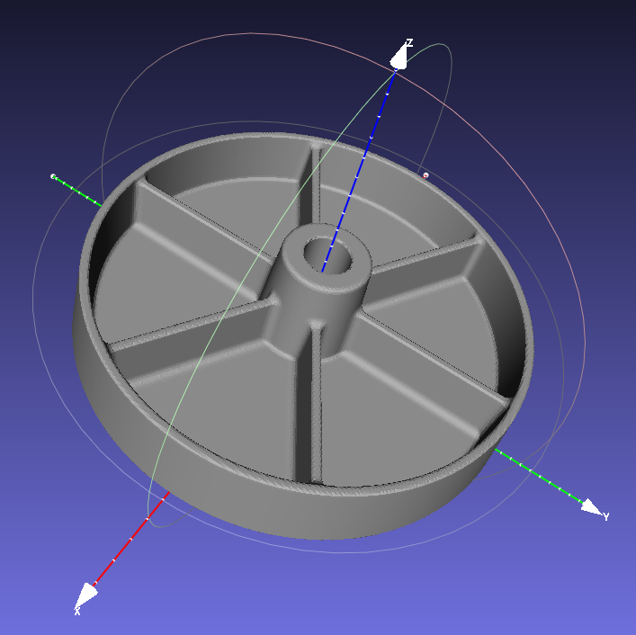
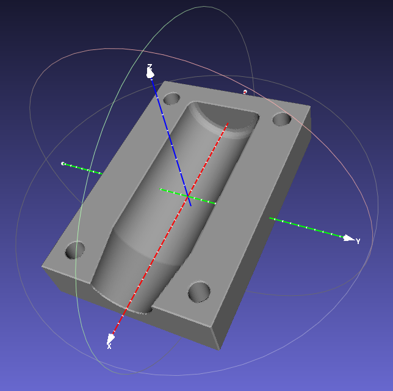

# sdfx

A simple CAD package written in Go (https://golang.org/)

 * Objects are modelled with 2d and 3d signed distance functions (SDFs).
 * The package is written in Go and the object is defined with Go code.
 * The object is rendered to an STL file to be viewed and/or 3d printed.

## How To
 1. See the examples.
 2. Write some Go code to define your own object.
 3. Build and run the Go code.
 4. Preview the STL output in an STL viewer (E.g. http://www.meshlab.net/)
 5. Print the STL file if you like.

## Why?
 * SDFs are cool.
 * As a language Golang > OpenSCAD.
 * OpenSCAD can't do automatic filleting and chamfers.
 * SDFs can do auto filleting and chamfering.
 * Very hackable to try out oddball ideas.
 * Who needs WYSIWYG?

## Gallery

